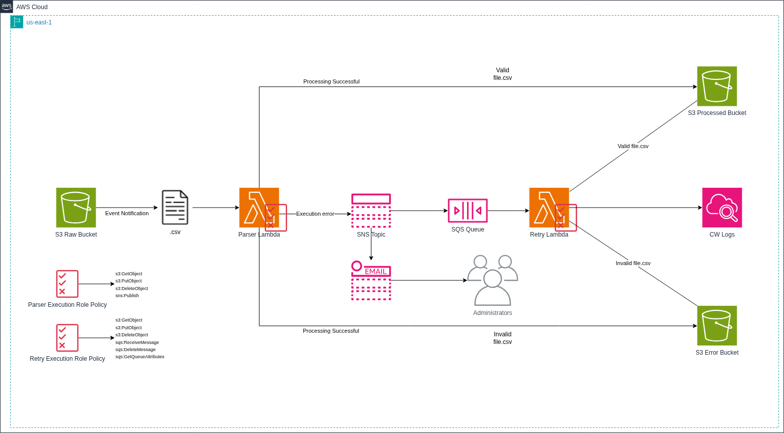
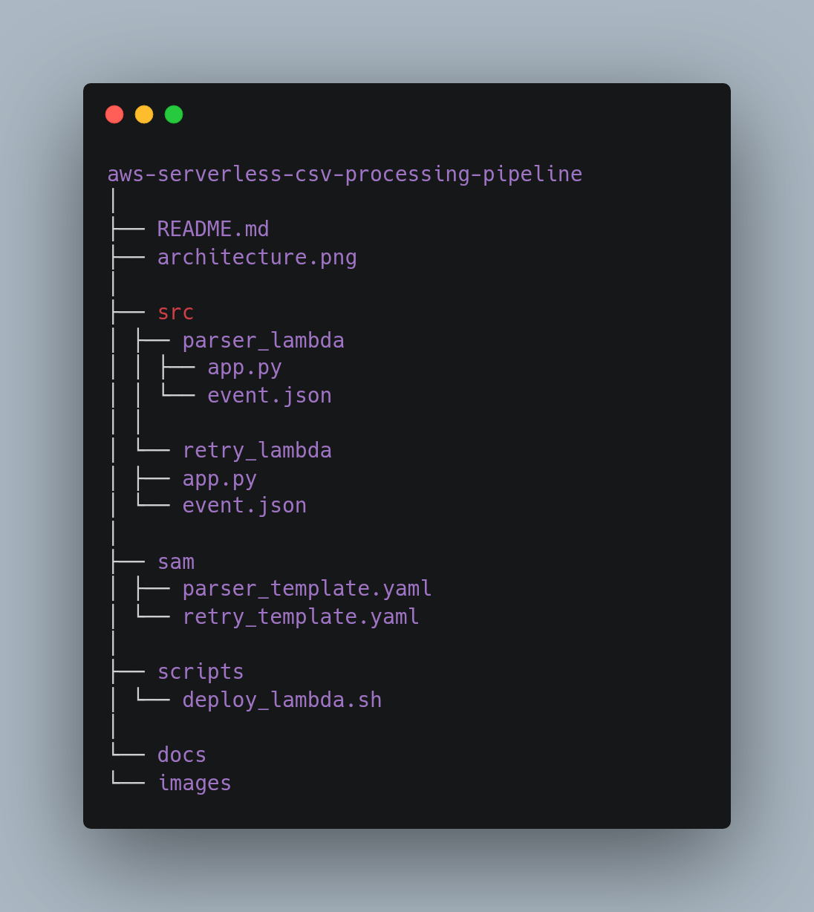
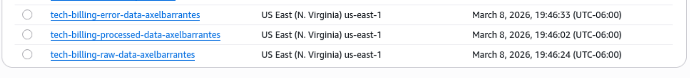
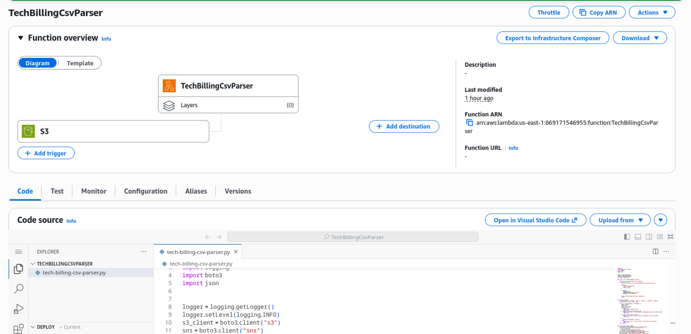
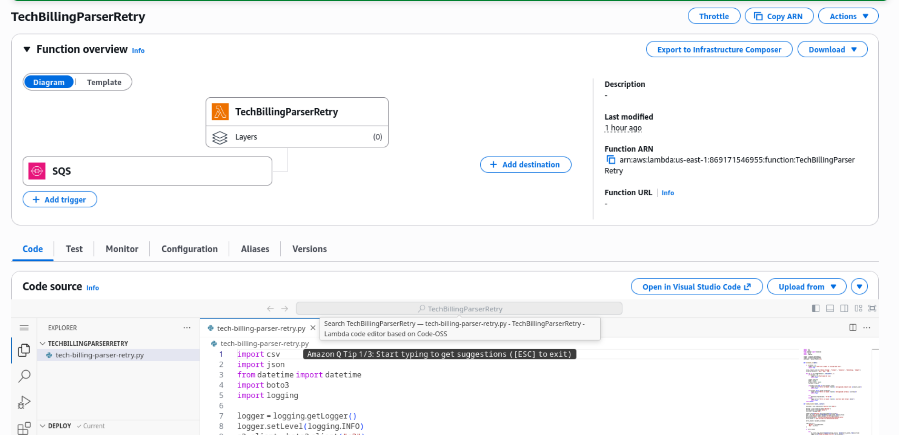
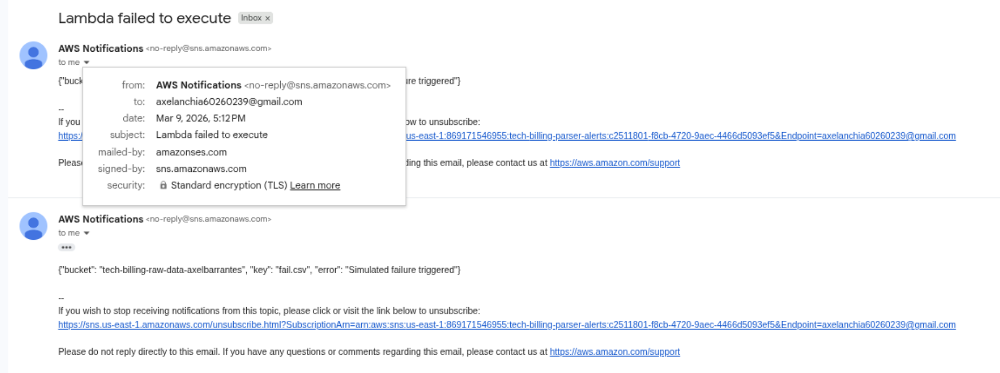
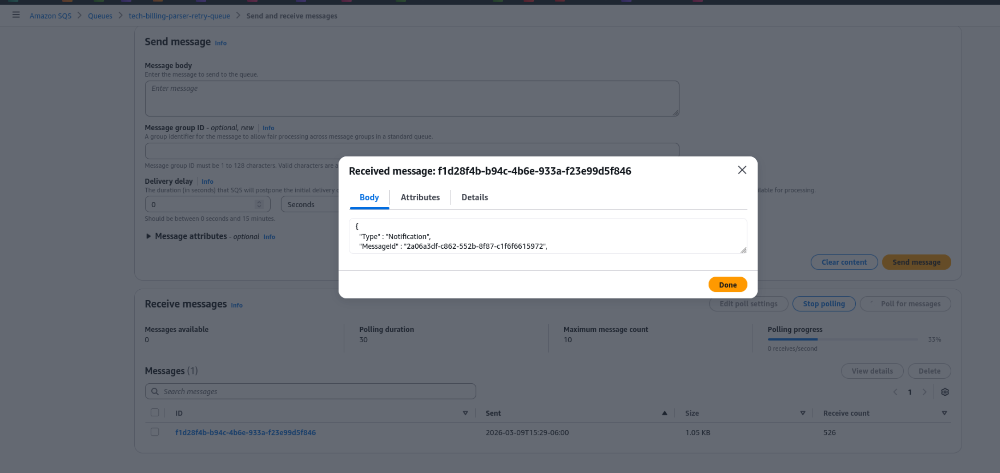
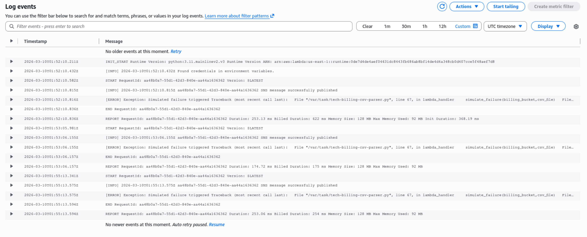

# Event-Driven Billing CSV Processor (AWS Serverless)
<!-- -------------------------------------------------- -->
A serverless, event-driven pipeline that processes billing CSV files using AWS services such as S3, Lambda, SNS, and SQS.
<!-- -------------------------------------------------- -->
The system validates CSV files, processes valid records, and implements asynchronous error handling with retries using SNS and SQS.
<!-- -------------------------------------------------- -->
<!-- -------------------------------------------------- -->
## System Architecture
<!-- -------------------------------------------------- -->
The following diagram shows the full event-driven architecture of the system.
<!-- -------------------------------------------------- -->

<!-- -------------------------------------------------- -->
## System Workflow
<!-- -------------------------------------------------- -->
1. A billing CSV file is uploaded to the **Raw S3 Bucket**.
<!-- -------------------------------------------------- -->
2. An **S3 Event Notification** triggers the **Parser Lambda**.
<!-- -------------------------------------------------- -->
3. The Parser Lambda validates the CSV schema and processes the file.
<!-- -------------------------------------------------- -->
4. If an error occurs, the Lambda publishes a message to an **SNS Topic**.
<!-- -------------------------------------------------- -->
5. The SNS topic performs **fan-out messaging**:
<!-- -------------------------------------------------- -->
   - Sends an **email notification** to administrators.
<!-- -------------------------------------------------- -->
   - Sends the message to an **SQS queue**.
<!-- -------------------------------------------------- -->
6. The **Retry Lambda** consumes messages from the SQS queue.
<!-- -------------------------------------------------- -->
7. The Retry Lambda attempts to process the file again.
<!-- -------------------------------------------------- -->
8. Depending on the result:
<!-- -------------------------------------------------- -->
   - Valid files are moved to the **Processed Bucket**
<!-- -------------------------------------------------- -->
   - Invalid files are moved to the **Error Bucket**
<!-- -------------------------------------------------- -->
9. Execution logs are stored in **CloudWatch Logs**.
<!-- -------------------------------------------------- -->
## Repository Structure

<!-- -------------------------------------------------- -->
## S3 Buckets
<!-- -------------------------------------------------- -->
The system uses three S3 buckets to manage the lifecycle of the CSV files.
<!-- -------------------------------------------------- -->
- Raw Bucket – incoming files
<!-- -------------------------------------------------- -->
- Processed Bucket – successfully processed files
<!-- -------------------------------------------------- -->
- Error Bucket – invalid or failed files
<!-- -------------------------------------------------- -->

<!-- -------------------------------------------------- -->
## Parser Lambda
<!-- -------------------------------------------------- -->
This Lambda function is triggered by an S3 event when a CSV file is uploaded.
<!-- -------------------------------------------------- -->
Responsibilities:
<!-- -------------------------------------------------- -->
- Read CSV file
<!-- -------------------------------------------------- -->
- Validate structure and content
<!-- -------------------------------------------------- -->
- Process billing data
<!-- -------------------------------------------------- -->
- Send error notifications to SNS if validation fails
<!-- -------------------------------------------------- -->

<!-- -------------------------------------------------- -->
<!-- -------------------------------------------------- -->
## Retry Lambda
<!-- -------------------------------------------------- -->
This Lambda function is triggered by messages in the SQS queue.
<!-- -------------------------------------------------- -->
Responsibilities:
<!-- -------------------------------------------------- -->
- Retry processing failed CSV files
<!-- -------------------------------------------------- -->
- Move files to the appropriate bucket depending on the result
<!-- -------------------------------------------------- -->

<!-- -------------------------------------------------- -->
<!-- -------------------------------------------------- -->
## Deploy Lambda Functions
<!-- -------------------------------------------------- -->
The Lambda functions can be deployed using the provided deployment scripts.
<!-- -------------------------------------------------- -->
### Make Scripts Executable
<!-- -------------------------------------------------- -->
Before running the scripts, ensure they have execution permissions:
<!-- -------------------------------------------------- -->
```bash
chmod +x scripts/deploy_parser_lambda.sh
chmod +x scripts/deploy_retry_lambda.sh
```
<!-- -------------------------------------------------- -->
Deploy Parser Lambda
<!-- -------------------------------------------------- -->
```bash
./scripts/deploy_parser_lambda.sh
```
<!-- -------------------------------------------------- -->
Deploy Retry Lambda
<!-- -------------------------------------------------- -->
```bash
./scripts/deploy_retry_lambda.sh
```
<!-- -------------------------------------------------- -->
These scripts package the Lambda source code and deploy it using the AWS CLI.
<!-- -------------------------------------------------- -->
If you encounter an error during deployment, verify that the $FUNCTION_NAME variable in the script matches the actual name of your Lambda function in AWS.
<!-- -------------------------------------------------- -->
<!-- -------------------------------------------------- -->
## Error Notifications
<!-- -------------------------------------------------- -->
When the parser encounters an error, it publishes a message to an SNS topic.
<!-- -------------------------------------------------- -->
SNS then:
<!-- -------------------------------------------------- -->
- Sends an **email notification to administrators**
<!-- -------------------------------------------------- -->
- Sends the message to an **SQS queue for retry processing**
<!-- -------------------------------------------------- -->

<!-- -------------------------------------------------- -->
<!-- -------------------------------------------------- -->
## Retry Queue (SQS)
<!-- -------------------------------------------------- -->
Failed processing events are stored in an SQS queue.
<!-- -------------------------------------------------- -->
This enables:
<!-- -------------------------------------------------- -->
- asynchronous retry processing
<!-- -------------------------------------------------- -->
- decoupled architecture
<!-- -------------------------------------------------- -->
- fault tolerance
<!-- -------------------------------------------------- -->

<!-- -------------------------------------------------- -->
<!-- -------------------------------------------------- -->
## Local Testing
<!-- -------------------------------------------------- -->
The functions can be tested locally using AWS SAM:
<!-- -------------------------------------------------- -->
```bash
sam local invoke -e event.json
```
<!-- -------------------------------------------------- -->
<!-- -------------------------------------------------- -->
## Monitoring and Logs
<!-- -------------------------------------------------- -->
All Lambda executions send logs to Amazon CloudWatch.
<!-- -------------------------------------------------- -->
This allows monitoring:
<!-- -------------------------------------------------- -->
- execution results
<!-- -------------------------------------------------- -->
- processing errors
<!-- -------------------------------------------------- -->
- retry attempts
<!-- -------------------------------------------------- -->
<!-- -------------------------------------------------- -->
### CloudWatch Logs
<!-- -------------------------------------------------- -->

<!-- -------------------------------------------------- -->
<!-- -------------------------------------------------- -->
### Log Streams
<!-- -------------------------------------------------- -->

<!-- -------------------------------------------------- -->
<!-- -------------------------------------------------- -->
## Technologies Used
<!-- -------------------------------------------------- -->
- **AWS Lambda** – serverless compute
<!-- -------------------------------------------------- -->
- **Amazon S3** – object storage for CSV files
<!-- -------------------------------------------------- -->
- **Amazon SNS** – notification service
<!-- -------------------------------------------------- -->
- **Amazon SQS** – asynchronous retry queue
<!-- -------------------------------------------------- -->
- **Amazon CloudWatch** – logging and monitoring
<!-- -------------------------------------------------- -->
- **AWS SAM** – local testing
<!-- -------------------------------------------------- -->
- **Python 3.11**
<!-- -------------------------------------------------- -->
<!-- -------------------------------------------------- -->
## Key Concepts Demonstrated
<!-- -------------------------------------------------- -->
- Event-Driven Architecture
<!-- -------------------------------------------------- -->
- Serverless Computing
<!-- -------------------------------------------------- -->
- Asynchronous Processing
<!-- -------------------------------------------------- -->
- Fault Tolerance
<!-- -------------------------------------------------- -->
- Decoupled System Design
<!-- -------------------------------------------------- -->
- Retry Mechanisms
<!-- -------------------------------------------------- -->
- Cloud Observability
<!-- -------------------------------------------------- -->
<!-- -------------------------------------------------- -->
## Future Improvements
<!-- -------------------------------------------------- -->
- Add Dead Letter Queue (DLQ) for failed retries
<!-- -------------------------------------------------- -->
- Implement schema validation using AWS Glue or Pandas
<!-- -------------------------------------------------- -->
- Add metrics and alarms in CloudWatch
<!-- -------------------------------------------------- -->
